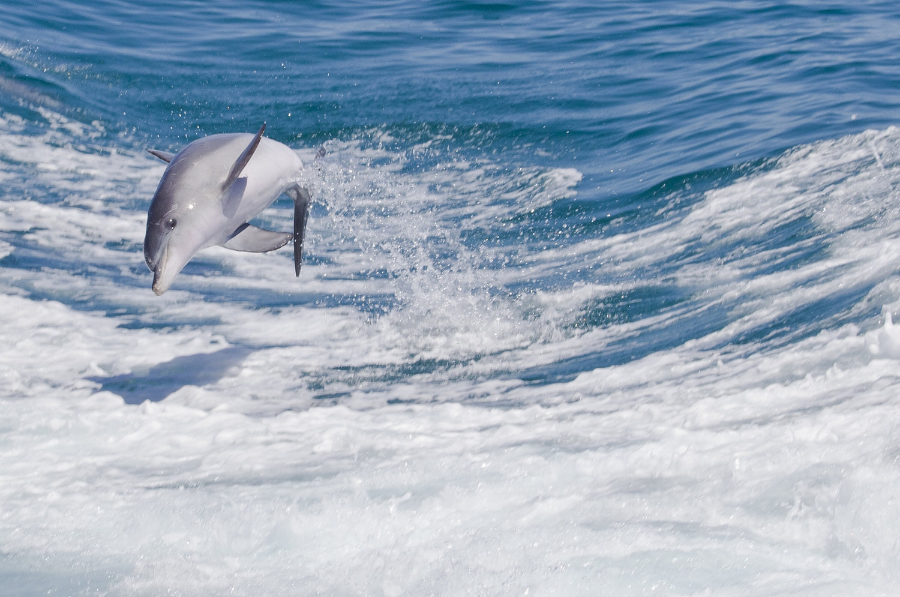

# Dolphin

Dolphins are widespread. Most species prefer the warm waters of the tropic zones, but some, such as the right whale dolphin, prefer colder climates. Dolphins feed largely on fish and squid, but a few, such as the orca, feed on large mammals such as seals. Male dolphins typically mate with multiple females every year, but females only mate every two to three years. 
