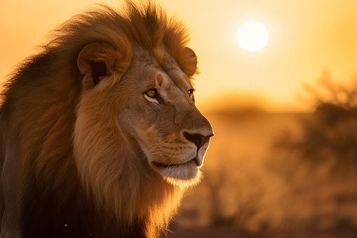

# Lion

The lion (Panthera leo) is a large cat of the genus Panthera native to Africa and India. It has a muscular, broad-chested body; short, rounded head; round ears; and a hairy tuft at the end of its tail. It is sexually dimorphic; adult male lions are larger than females and have a prominent mane. It is a social species, forming groups called prides. 
